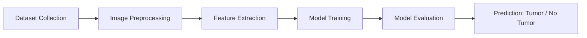

# 🧠 Brain Tumor Detection using Machine Learning

## 🧬 Project Overview

   This project is an **AI-based Brain Tumor Detection system** that analyzes MRI scan images to classify whether a tumor is present or not.

It uses **Machine Learning / Deep Learning techniques** to assist in early diagnosis, making medical image analysis faster and more efficient.

---

## 🎯 Key Features

* 🧠 Detects brain tumor from MRI images
* ⚡ Fast and automated prediction
* 📊 Data preprocessing and feature extraction
* 🤖 ML/DL-based classification model
* 🖥️ Easy-to-run Python project
* 📈 Model evaluation and accuracy measurement

---

## 🖼️ Sample Output

### MRI Scan Prediction

| Input MRI Image | Prediction                    |
| --------------- | ----------------------------- |
| 🧠 MRI Scan     | ✅ Tumor Detected / ❌ No Tumor |

> (**Note:** The Result images are added in the result screenshots folder)

---

## 🧰 Technologies Used

* Python 🐍
* NumPy
* Pandas
* OpenCV
* Matplotlib
* Scikit-learn
* TensorFlow / Keras *(if used)*
* Jupyter Notebook / VS Code

---

## 🏗️ Project Workflow



---

## 📁 Project Structure

```bash
brain-tumor-detection-ml/
│
├── dataset/              # MRI images dataset
├── model/               # Trained model files
├── notebooks/           # Jupyter notebooks
├── static/              # UI assets (if any)
├── templates/           # HTML templates (if Flask app)
├── app.py               # Main application file
├── requirements.txt     # Dependencies
└── README.md
```

---

## ⚙️ Installation

### 1️⃣ Clone the Repository

```bash
git clone https://github.com/IshaqRiaz/brain-tumor-detection-ml.git
cd brain-tumor-detection-ml
```

### 2️⃣ Create Virtual Environment

```bash
python -m venv venv
```

### 3️⃣ Activate Environment

**Windows:**

```bash
venv\Scripts\activate
```

### 4️⃣ Install Dependencies

```bash
pip install -r requirements.txt
```

---

## ▶️ Run Project

### If Flask App:

```bash
python app.py
```
* .Open:
   http://127.0.0.1:5000/
---

## 📊 Model Performance

* High accuracy achieved on test dataset
* Good generalization on MRI image classification
* Optimized preprocessing improves prediction quality

---

## 🚀 Future Improvements

* 🔬 Improve accuracy using advanced CNN architectures
* 🌐 Deploy using Streamlit / Flask web app
* 📱 Add mobile-friendly interface
* ☁️ Deploy on cloud (AWS / Render / HuggingFace)
* 🧠 Train on larger medical datasets

---

## 👨‍💻 Author

**Muhammad Ishaq**
📧 Email: [ishaqriaz12345@gmail.com](mailto:ishaqriaz12345@gmail.com)
🔗 GitHub: [IshaqRiaz](https://github.com/IshaqRiaz)

---

## ⭐ Support

If you like this project:

* ⭐ Star the repository
* 🍴 Fork it
* 🧠 Share it with others

---

